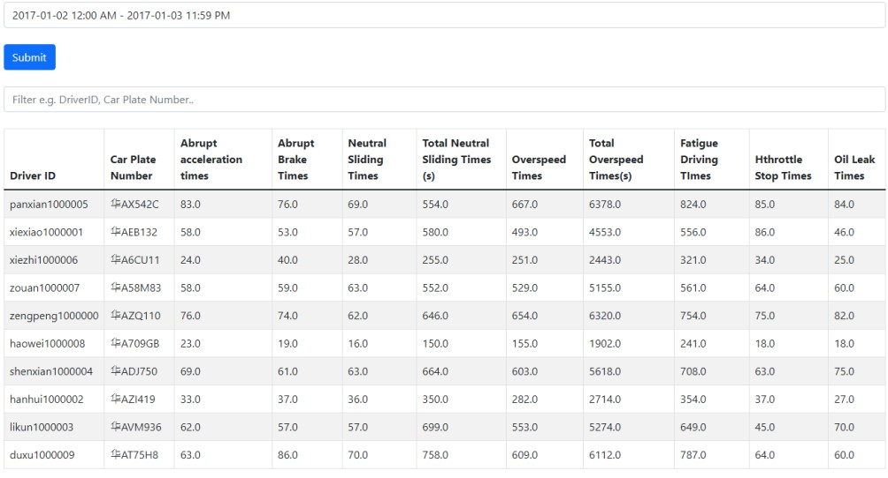
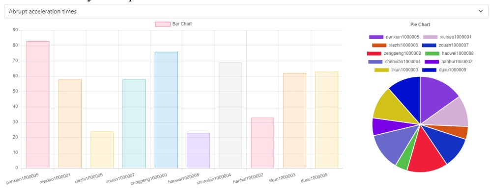
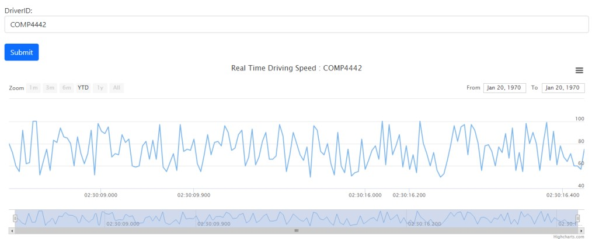
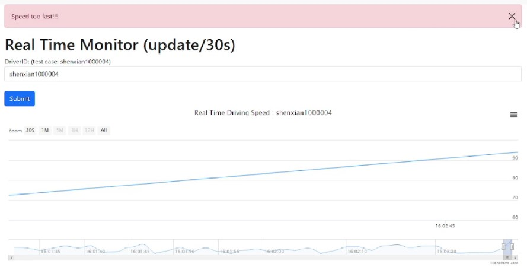

# COMP4442_Group_Project - Drive behavior and monitoring application

&nbsp;
&nbsp;
&nbsp;
&nbsp;
&nbsp;

1. Install [Anaconda](https://www.anaconda.com/)
2. Click Environment > Create > tick Python 3.10.4

Activate environment ("COMP4442" is your environment name)
```
conda activate COMP4442
```

Check Python version
```
Python -V
```

Check package lists
```
pip list
```

Generate requirements.txt
```
pip freeze > requirements.txt
```

install package from requirements.txt in conda
```
conda install --yes --file requirements.txt
```
 
Run: ("COMP4442" is your environment name)
```
conda activate COMP4442
cd FlaskApp
python main.py
```

 Folder structure


    .
    ├── data-after-spark             # data after running the AWS EMR
    ├── DB                           # Folder for code related to DB/Spark
    │    ├── connection.py           # code of connecting to DB  
    │    ├── initDB.sql              # query to create database and table 
    │    ├── Spark_aws_EMR.py        # Spark code on AWS EMR
    │    ├── spark_colab.ipynb       # Spark code on Google Colab (for testing,debug etc)
    │    ├── gen_data_for_monitor.py # generate data and insert to monitor table
    │    ├── readData.py             # upload given speed data to DB
    │    └── upload_data_to_DB.py    # read the csv in data-after-spark and upload to DB
    ├── detail-record                # original data set
    ├── FlaskApp                     # Folder for Flask app code
    │   ├── website                  # website source code
    │   │      ├── static            # All css/js/images put here
    │   │      ├── templates         # All html files put here
    │   │      ├── __init__.py       # Flask init code
    │   │      └── views.py          # code for define URL route
    │   └── application.py           # main.py
    ├── website.zip                  # zip file used to upload to AWS Elastic Beanstalk
    ├── Demo Video.mp4               # Demo video
    ├── Report.pdf                   # Report document    
    └── ...
    

## Documentation
[Link](Report.pdf)

## Some screenshots
Dashboard:

Data Summary:

Summary Chart:

Real Time Monitor:

Real Time Monitor with Error Message:
